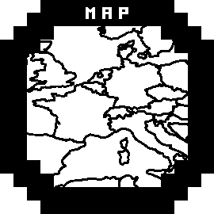

# Map Offline (GPS)

Shows map image around current position. Aimed to give navigation ability for watches without maps and courses.

* As memory is limited, best to use 2 colors image.
* For 2 colors and 16 KB memory - max size is: 2000 x 2000 px.
* As an example, shows world map (based on [STyx](https://commons.wikimedia.org/wiki/File:World_location_map.svg)'s map).
* Refreshes only when is visible (auto call `onUpdate()` function), to reduce calculations.
* Shows static image, no zoom.




## Usage

* Copy compiled `Map.prg` to the `APPS\` directory.
* Select: `Activity Settings` → `Data Screens` → `Screen #` → `Field #` → `Connect IQ` → `Map`.


## Compile

### Prepare map.png
* Image should be black-and-white, 2000 x 2000 px.
* Look for printable/simple/bw/outline maps online, or use [map viewer](map/map_viewer.md) with editable style, or decrease color depth in graphic program.
* Suggestion: you can mark on map some paths and points.

### Download
* [**ImageMagick**](https://imagemagick.org/script/download.php#windows) zip. You can use `portable-Q16` version, `x86` or `x64` as your system.
* **OpenSSL** zip: [curl.se](https://curl.se/windows/) (`Specifications` → `32bit` or `64`) or [bintray.com](https://bintray.com/vszakats/generic/openssl) (version → `Files` → `win32` or `64`).
* [**Dev-kit**](https://developer.garmin.com/connect-iq/sdk/). Current version requires SDK Manager (login required) to download kit and selected devices.
#### archive.org
* ImageMagick: [7.0.11-0](http://web.archive.org/web/20210215174500/https://imagemagick.org/script/download.php#windows) → portable-Q16-x: [86](http://web.archive.org/web/20210215174728/https://download.imagemagick.org/ImageMagick/download/binaries/ImageMagick-7.0.11-0-portable-Q16-x86.zip) | [64](http://web.archive.org/web/20210215174635/https://download.imagemagick.org/ImageMagick/download/binaries/ImageMagick-7.0.11-0-portable-Q16-x64.zip)
* OpenSSL: curl.se [1.1.1i](http://web.archive.org/web/20210206153430/https://curl.se/windows/) → [32](http://web.archive.org/web/20210215174443/https://curl.se/windows/dl-7.75.0/openssl-1.1.1i-win32-mingw.zip) | [64](http://web.archive.org/web/20210215174507/https://curl.se/windows/dl-7.75.0/openssl-1.1.1i-win64-mingw.zip) or bintray.com [1.1.1h](http://web.archive.org/web/20210203211808/https://bintray.com/vszakats/generic/openssl) → [32](http://web.archive.org/web/20210203212704/https://dl.bintray.com/vszakats/generic/openssl-1.1.1h-win32-mingw.zip) | [64](http://web.archive.org/web/20210203212909/https://dl.bintray.com/vszakats/generic/openssl-1.1.1h-win64-mingw.zip)
* Dev-kit: [3.1.9](http://web.archive.org/web/20200712153511/https://developer.garmin.com/connect-iq/sdk/) → [zip](http://web.archive.org/web/20210204181053/https://developer.garmin.com/downloads/connect-iq/sdks/connectiq-sdk-win-3.1.9-2020-06-24-1cc9d3a70.zip) - was the last version with `Direct Download` (contains kit and all devices).

### Paths
* Add paths to dirs where unpacked.
* At the end of `Path` variable, separate by semi-colon `;`
  - `sysdm.cpl` → `Advanced` → `Environment Variables...` → `System variables` → `Path`
  - Example: `C:\ImageMagick\;C:\openssl\;C:\ciq\bin\`
  - Then you can use short: `convert`, `openssl`, `monkeyc`
* Or add before each command: `C:\ciq\bin\monkeyc`
* If using SDK Manager, then path is:
  - `%AppData%\Garmin\ConnectIQ\Sdks\connectiq-sdk-win-VERSION\bin\`

### resources\m
* You can use bat scripts from temp dir `map\`.
* ImageMagick:
  - `index-colors.bat` - simply decrease color depth: `convert map-color.png -threshold 70% map.png`
  - `crop.bat` - crop prepared map (create `m` dir first): `convert map.png -crop 250x250 m\%01d.png`
* Check if map is correctly cropped and copy it to: `resources\m` dir.
* 2000 x 2000 px cropped to 250 x 250 gives 64 parts (from `0.png` to `63.png`).

### map.mc
* Check where your map starts (left upper corner) and ends (right down corner).
* And enter those coordinates here (latitude and longitude).
```
const ut=83.64, un=-180.0,  // left upper corner
      dt=-66.20, dn=180.0,  // right down corner
```

### dev_key.der
* Generate key using OpenSSL - `gen_key.bat`:
```
openssl genrsa -out dev_key.pem 4096
openssl pkcs8 -topk8 -inform PEM -outform DER -in dev_key.pem -out dev_key.der -nocrypt
```

### Map.prg
* Replace `DEVICE` by your device id (check `manifest.xml` or `bin\devices.xml` at kit) - `compile-release.bat`:
```
monkeyc -y dev_key.der -f MapOfflineGPS\monkey.jungle -r -o Map.prg -d DEVICE
```


## [Edit size](edit_size.md)